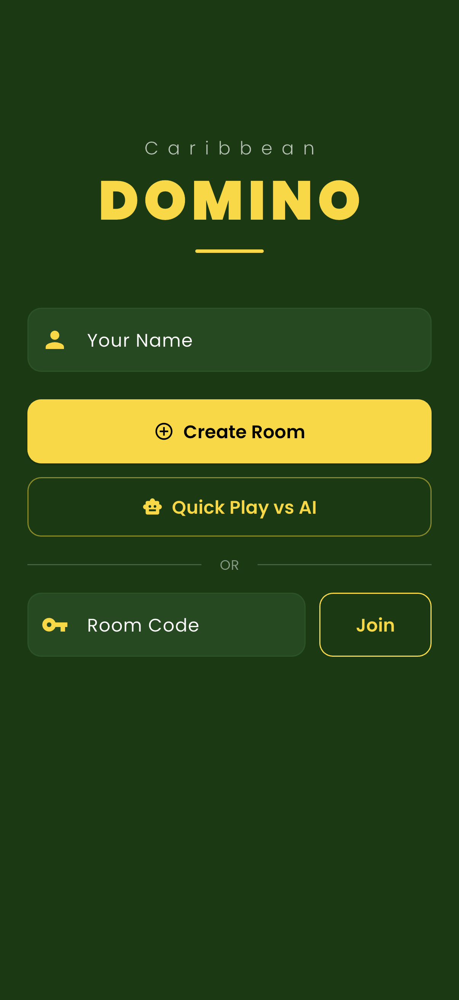
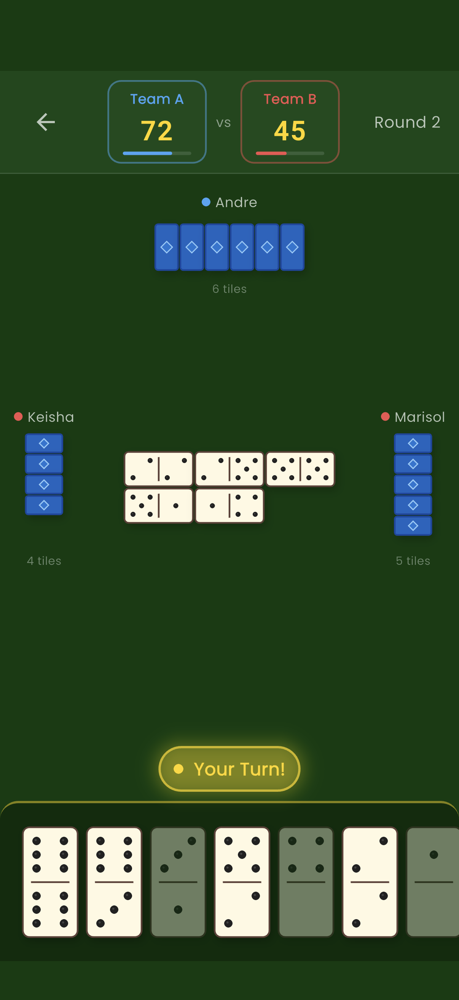
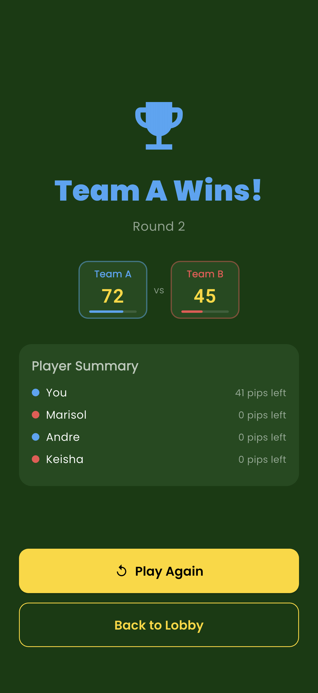
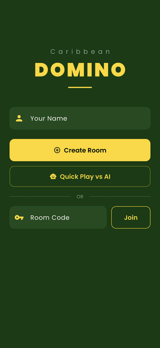

# Caribbean Domino Game - Real-time Multiplayer

A real-time multiplayer Caribbean-style domino game built with Flutter and backed by Supabase + Vercel serverless API. Features 4-player team matches (2v2), AI bot opponents, room-based matchmaking, and custom-rendered domino tiles with animations.

## Demo

Real captures from the iOS Simulator (no mockups), produced by an integration-test driver. See [FLOW.md](FLOW.md) for how they are generated.

| Lobby | Gameplay | Results |
|:---:|:---:|:---:|
|  |  |  |
| Create or join rooms, quick play vs AI | Board chain, opponent hands, turn indicator, live scores | Trophy, team scoreboard, per-player pip summary |



## Tech Stack

- **Flutter** - Cross-platform mobile framework (iOS/Android)
- **Riverpod** - State management
- **Supabase Realtime** - Real-time game state synchronization via PostgreSQL change streams
- **Vercel API** - Serverless Node.js backend for game logic
- **Freezed** - Immutable data models with JSON serialization
- **GoRouter** - Declarative routing
- **CustomPainter** - Custom domino tile rendering with pip layouts
- **flutter_animate** - Tile placement, flip, and score animations

## Features

- 4-player team-based domino (2 teams of 2)
- Room-based matchmaking with shareable room codes
- Quick Play vs AI with bot opponents (Alpha, Beta, Gamma)
- Real-time game state sync across all connected clients
- Custom-rendered domino tiles with standard pip layouts (0-6)
- Interactive board with pan/zoom support
- Tile placement animations and dealing flip animations
- Haptic feedback for tile placement, pass, and win events
- Score tracking with animated counters and progress bars
- Turn indicators with pulsing glow effects
- Dark green felt-table themed UI

## Setup

1. Configure your API URLs in `lib/core/constants/api_config.dart`:
   - Set `vercelApiUrl` to your deployed Vercel domino server
   - Set `supabaseUrl` and `supabaseAnonKey` to your Supabase project credentials

2. Install dependencies:
   ```bash
   flutter pub get
   ```

3. Generate code (freezed models):
   ```bash
   dart run build_runner build --delete-conflicting-outputs
   ```

4. Run the app:
   ```bash
   flutter run
   ```

## Architecture

```
lib/
  core/          - Constants, theme, services
  data/          - Models (freezed) and repositories (API, Realtime)
  domain/        - Business logic services
  presentation/  - UI layer (providers, router, screens, shared widgets)
```

## Game Rules

- 28 tiles (double-six set)
- 4 players, 7 tiles each
- Teams: players across from each other (seats 0+2, seats 1+3)
- First to empty their hand scores the round
- Blocked game: team with lowest remaining pip count scores
- First team to 100 points wins
